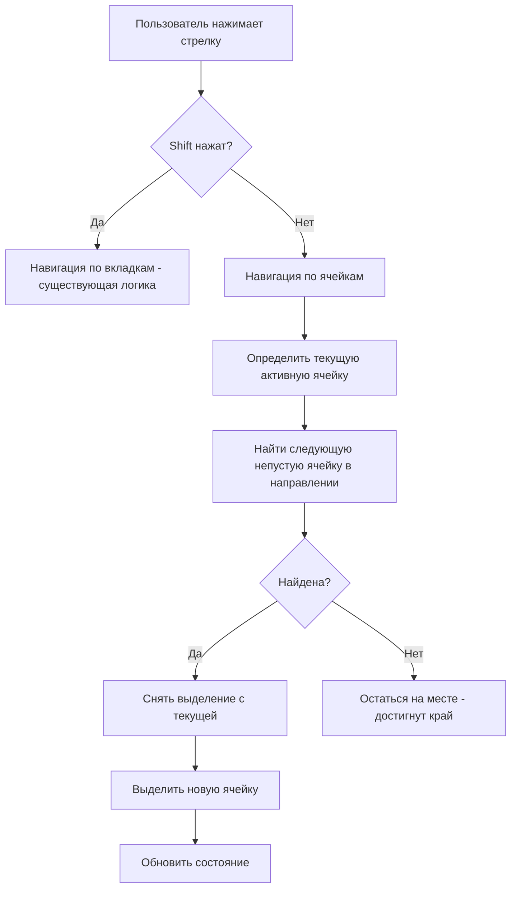

# План: Навигация по ячейкам таблицы стрелками

## Обзор задачи

Добавить возможность навигации по ячейкам таблицы с помощью стрелок (←→↑↓) с пропуском пустых ячеек (с пустым `url`), визуальным выделением активной ячейки и открытием ссылки по Enter.

## Текущая структура

| Файл | Роль |
|------|------|
| [`app.js`](app.js:40) | Обработчик `Shift + Arrow` для навигации по вкладкам |
| [`js/renderTable.js`](js/renderTable.js:1) | Рендеринг таблицы, создание `<td>` с ссылками |
| [`styles.css`](styles.css:82) | Стили ячеек, hover-эффекты |
| [`index.html`](index.html:15) | Подключение скриптов |

## Требования

1. **Навигация стрелками**: ←→↑↓ перемещают активную ячейку
2. **Пропуск пустых**: ячейки с пустым `url` игнорируются
3. **Остановка на краю**: при достижении края таблицы — оставаться на месте
4. **Визуальное выделение**: активная ячейка выделяется цветом/рамкой
5. **Enter**: открывает ссылку активной ячейки в новой вкладке
6. **README**: обновить документацию

## Архитектура решения



## Детали реализации

### 1. CSS: стиль активной ячейки

Добавить в [`styles.css`](styles.css:82) класс `.cell-active`:

```css
.data-table td.cell-active {
    outline: 2px solid #4F46E5;
    background: #e8eaff;
}
```

### 2. Модификация renderTable.js

Добавить data-атрибут для标记 ячеек с url:

```js
td.dataset.hasUrl = cell.url ? 'true' : 'false';
```

### 3. Новый модуль cellNavigation.js

Создать [`js/cellNavigation.js`](js/cellNavigation.js) с логикой:

**Состояние:**
- `currentRow` — индекс текущей строки
- `currentCol` — индекс текущей колонки

**Функции:**
- `initNavigation(table)` — инициализация, найти первую непустую ячейку
- `findNextCell(direction)` — поиск следующей непустой ячейки в направлении
- `moveActive(row, col)` — переместить выделение
- `openActiveCell()` — открыть ссылку активной ячейки

**Алгоритм findNextCell:**
```
direction = 'left' | 'right' | 'up' | 'down'
начать с текущей позиции
двигаться в направлении
пропускать ячейки с hasUrl='false'
вернуть первую найденную непустую ячейку
если достигнут край — вернуть null
```

### 4. Обработчик клавиш

В [`app.js`](app.js:40) или новом модуле добавить обработчик:

```js
document.addEventListener('keydown', (e) => {
    if (e.shiftKey) return; // Shift + Arrow = навигация по вкладкам
    
    const arrows = ['ArrowLeft', 'ArrowRight', 'ArrowUp', 'ArrowDown'];
    if (!arrows.includes(e.key)) return;
    
    e.preventDefault();
    // Логика навигации по ячейкам
});
```

### 5. Подключение скрипта

В [`index.html`](index.html:18) добавить:
```html
<script src="js/cellNavigation.js"></script>
```

### 6. Обновление README.md

Добавить в раздел "Особенности":
```markdown
- **Навигация по ячейкам**: стрелки ←→↑↓ для перемещения по ячейкам (пустые пропускаются), Enter — открыть ссылку
```

## Последовательность шагов

1. Добавить CSS-класс `.cell-active` в [`styles.css`](styles.css:82)
2. Модифицировать [`js/renderTable.js`](js/renderTable.js:14) — добавить `data-has-url`
3. Создать [`js/cellNavigation.js`](js/cellNavigation.js) с логикой навигации
4. Подключить скрипт в [`index.html`](index.html:18)
5. Обновить [`README.md`](README.md:53) — добавить описание функциональности

## Граничные случаи

- Таблица не загружена — навигация неактивна
- Все ячейки пустые — выделение остаётся на месте
- Первая/последняя ячейка — остановка на краю
- Пустая строка/колонка — пропуск при навигации
