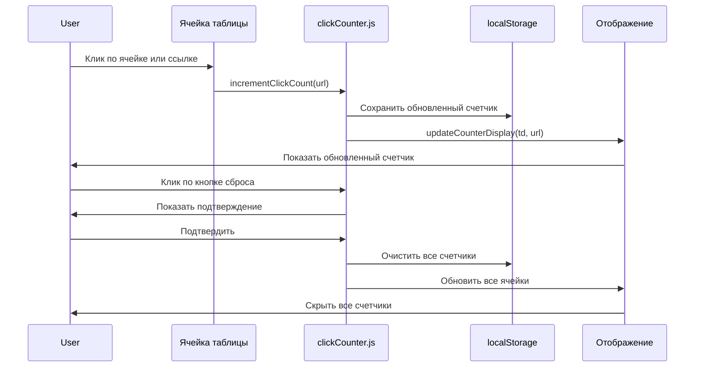

# План реализации счетчиков переходов

## Обзор задачи

Добавить счетчики количества переходов по ссылкам в каждой ячейке таблицы. Счетчик отображается в кружочке в правом верхнем углу ячейки, слегка выезжая за края. Данные хранятся в localStorage и сохраняются между перезапусками браузера.

## Требования

- **Идентификация**: по URL ячейки (если URL изменится, счетчик сбросится)
- **Отображение**: только когда счетчик > 0
- **Сброс**: кнопка в интерфейсе для сброса всех счетчиков
- **Триггеры**: клик по ячейке или по тексту ссылки (оба варианта увеличивают счетчик)
- **Палитра**: Dracula

## Архитектура решения

### 1. Структура хранения данных в localStorage

```javascript
// Ключ: 'linkClickCounters'
// Значение: объект с ключами-URL и значениями-счетчиками
{
  "https://github.com": 5,
  "https://stackoverflow.com": 3,
  "https://developer.mozilla.org": 12
}
```

### 2. Модуль clickCounter.js

Создать новый файл `js/clickCounter.js` со следующими функциями:

```javascript
/**
 * Получить значение счетчика для URL
 * @param {string} url - URL ячейки
 * @returns {number} - количество переходов
 */
function getClickCount(url)

/**
 * Увеличить счетчик для URL
 * @param {string} url - URL ячейки
 */
function incrementClickCount(url)

/**
 * Сбросить все счетчики
 */
function resetAllClickCounters()

/**
 * Обновить отображение счетчика для ячейки
 * @param {HTMLElement} td - элемент ячейки
 * @param {string} url - URL ячейки
 */
function updateCounterDisplay(td, url)
```

### 3. Изменения в renderTable.js

- После создания ячейки `td` и добавления ссылки, вызвать `updateCounterDisplay(td, cell.url)`
- Добавить обработчик клика на ссылку `<a>` для инкремента счетчика (сейчас клик по ячейке уже обрабатывается, но клик по ссылке проходит мимо)

### 4. Обработка кликов

**Текущая логика** (в renderTable.js):
```javascript
td.addEventListener('click', (e) => {
    if (e.target.tagName !== 'A') {
        a.click();
    }
});
```

**Новая логика**:
- Добавить обработчик на `<a>` для инкремента счетчика
- Добавить обработчик на `td` для инкремента счетчика (когда клик не по ссылке)
- Оба обработчика вызывают `incrementClickCount(url)` и `updateCounterDisplay(td, url)`

### 5. CSS стили для счетчика

Добавить в `styles.css`:

```css
/* Счетчик переходов */
.click-counter {
    position: absolute;
    top: -8px;
    right: -8px;
    background: var(--dracula-pink);
    color: var(--dracula-bg);
    border-radius: 50%;
    min-width: 20px;
    height: 20px;
    display: flex;
    align-items: center;
    justify-content: center;
    font-size: 11px;
    font-weight: 700;
    padding: 0 4px;
    box-shadow: 0 2px 6px rgba(0,0,0,0.4);
    z-index: 10;
}
```

### 6. Кнопка сброса всех счетчиков

**Расположение**: в правом нижнем углу страницы, рядом с табами

**HTML структура** (создается динамически в app.js):
```html
<button class="reset-counters-btn" title="Сбросить все счетчики">
    🔄
</button>
```

**CSS стили**:
```css
.reset-counters-btn {
    position: fixed;
    bottom: 20px;
    right: 20px;
    background: var(--dracula-selection);
    color: var(--dracula-fg);
    border: none;
    border-radius: 6px;
    padding: 8px 12px;
    cursor: pointer;
    font-size: 16px;
    transition: all 0.2s;
    z-index: 100;
    box-shadow: 0 2px 8px rgba(0,0,0,0.4);
}

.reset-counters-btn:hover {
    background: var(--dracula-red);
}
```

**Логика**:
- При клике показать `confirm()` для подтверждения
- Если подтверждено, вызвать `resetAllClickCounters()`
- Обновить все отображения счетчиков на странице

### 7. Подключение модулей

В `index.html` добавить:
```html
<script src="js/clickCounter.js"></script>
```

Порядок подключения (после renderTable.js, до app.js):
```html
<script src="js/renderTable.js"></script>
<script src="js/clickCounter.js"></script>
<script src="js/cellNavigation.js"></script>
<script src="js/tooltip.js"></script>
<script src="app.js"></script>
```

## Диаграмма потока данных



## Порядок реализации

1. Создать `js/clickCounter.js` с функциями работы со счетчиками
2. Модифицировать `js/renderTable.js`:
   - Добавить вызов `updateCounterDisplay()` при рендеринге
   - Добавить обработчики кликов для инкремента счетчика
3. Добавить CSS стили в `styles.css`:
   - Стили для `.click-counter`
   - Стили для `.reset-counters-btn`
4. Модифицировать `app.js`:
   - Создать кнопку сброса
   - Добавить обработчик клика на кнопку
5. Обновить `index.html`:
   - Подключить `clickCounter.js`
6. Обновить `README.md` с описанием новой функции

## Тестирование

- Клик по ячейке увеличивает счетчик
- Клик по ссылке внутри ячейки увеличивает счетчик
- Счетчик отображается только когда > 0
- Данные сохраняются после перезагрузки страницы
- Данные сохраняются после закрытия и повторного открытия браузера
- Кнопка сброса очищает все счетчики
- Счетчики корректно отображаются на всех вкладках
- При изменении URL в данных счетчик для нового URL начинается с 0
